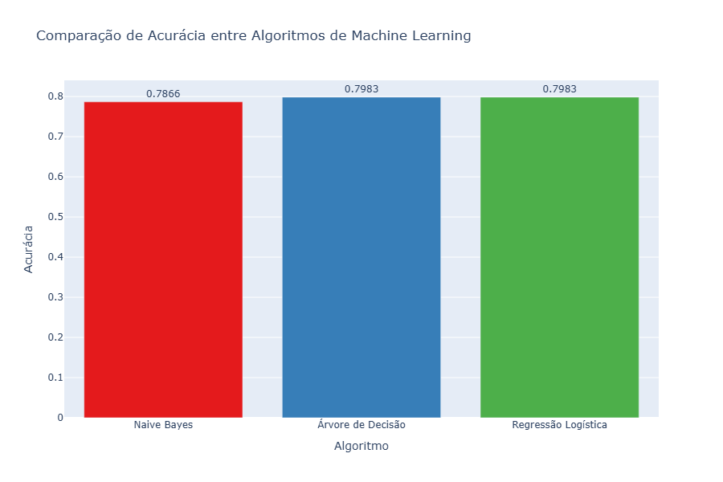

# 🤖 Análise de Sentimentos em Reclamações de Consumidores

Este projeto realiza uma **análise de sentimentos** sobre as **reclamações de consumidores** em relação a diversas empresas, com o objetivo de entender como as organizações lidam com as disputas dos clientes. O foco é identificar os problemas mais frequentes e fornecer **recomendações** para melhorar o sentimento dos consumidores em relação a essas instituições.

---

## 📂 Sobre o Projeto

Neste notebook, realizamos uma análise detalhada de como as organizações lidam com **reclamações de consumidores**. A análise utiliza **Machine Learning** para classificar o sentimento dos consumidores com base nas transcrições das reclamações. Abaixo estão os principais objetivos do projeto:

<ul>
    <li>Determinar as <strong>principais empresas</strong> que mais receberam disputas.</li>
    <li>Analisar se a tendência de disputas está <strong>aumentando ou diminuindo</strong>.</li>
    <li>Avaliar o <strong>sentimento geral</strong> das reclamações.</li>
    <li>Investigar o <strong>sentimento</strong> das reclamações para as principais empresas com disputas, com base nos problemas relatados pelos consumidores.</li>
</ul>

---

## 🛠️ Tecnologias Utilizadas

<ul>
    <li><strong>Python</strong> 🐍</li>
    <li><strong>Pandas & Numpy</strong></li>
    <li><strong>Scikit-learn</strong></li>
    <li><strong>Plotly Express</strong> 📊</li>
    <li><strong>Matplotlib</strong></li>
    <li><strong>Jupyter Notebook</strong></li>
</ul>

---

## 📝 Descrição das Colunas do Dataset

O dataset contém informações detalhadas sobre as reclamações dos consumidores. Abaixo está uma descrição de cada uma das colunas presentes no conjunto de dados:

<table>
  <tr>
    <th><strong>Coluna</strong></th>
    <th><strong>Descrição</strong></th>
  </tr>
  <tr>
    <td><strong>date_received</strong></td>
    <td>📅 Data em que a reclamação foi recebida pela instituição reguladora (ex: CFPB nos EUA).</td>
  </tr>
  <tr>
    <td><strong>product</strong></td>
    <td>📦 Produto principal relacionado à reclamação, como "Cartão de Crédito", "Empréstimo Estudantil", "Conta Corrente", etc.</td>
  </tr>
  <tr>
    <td><strong>sub_product</strong></td>
    <td>🔍 Subcategoria do produto, por exemplo, "Cartão com cashback" quando o produto for "Cartão de Crédito".</td>
  </tr>
  <tr>
    <td><strong>issue</strong></td>
    <td>⚠️ Problema relatado pelo consumidor, como "Cobrança indevida", "Erro de processamento", etc.</td>
  </tr>
  <tr>
    <td><strong>sub_issue</strong></td>
    <td>🧩 Subcategoria do problema, fornecendo mais detalhes do **issue**.</td>
  </tr>
  <tr>
    <td><strong>consumer_complaint_narrative</strong></td>
    <td>📝 Narrativa textual da reclamação feita pelo consumidor. Usada para análise de sentimentos e PLN (Processamento de Linguagem Natural).</td>
  </tr>
  <tr>
    <td><strong>company_public_response</strong></td>
    <td>🗣️ Resposta pública da empresa sobre o caso (se fornecida).</td>
  </tr>
  <tr>
    <td><strong>company</strong></td>
    <td>🏢 Nome da empresa contra a qual a reclamação foi feita.</td>
  </tr>
  <tr>
    <td><strong>state</strong></td>
    <td>🗺️ Estado onde a reclamação foi registrada.</td>
  </tr>
  <tr>
    <td><strong>zipcode</strong></td>
    <td>📮 Código postal (CEP) do consumidor.</td>
  </tr>
  <tr>
    <td><strong>tags</strong></td>
    <td>🏷️ Marcadores adicionais, como "Idoso", "Militar", "Consumidor com deficiência", etc.</td>
  </tr>
  <tr>
    <td><strong>consumer_consent_provided</strong></td>
    <td>✅ Se o consumidor deu consentimento para publicar o conteúdo da reclamação.</td>
  </tr>
  <tr>
    <td><strong>submitted_via</strong></td>
    <td>💻 Canal pelo qual a reclamação foi submetida, como "Telefone", "Web", "E-mail", etc.</td>
  </tr>
  <tr>
    <td><strong>date_sent_to_company</strong></td>
    <td>📬 Data em que a reclamação foi enviada à empresa para resposta.</td>
  </tr>
  <tr>
    <td><strong>company_response_to_consumer</strong></td>
    <td>📃 Tipo de resposta da empresa, como "Problema resolvido", "Resposta em andamento", "Sem justificativa", etc.</td>
  </tr>
  <tr>
    <td><strong>timely_response</strong></td>
    <td>⏰ Se a empresa respondeu dentro do prazo (normalmente "Yes" ou "No").</td>
  </tr>
  <tr>
    <td><strong>consumer_disputed?</strong></td>
    <td>⚖️ Se o consumidor disputou ou contestou a resposta da empresa (usado em sua análise, com foco em Yes e No).</td>
  </tr>
  <tr>
    <td><strong>complaint_id</strong></td>
    <td>🆔 Identificador único da reclamação.</td>
  </tr>
</table>

---

## ⚙️ Algoritmos Avaliados

Foram avaliados três algoritmos de **Machine Learning** para a tarefa de análise de sentimentos nas reclamações:

<table>
  <tr>
    <th><strong>Algoritmo</strong></th>
    <th><strong>Acurácia</strong></th>
  </tr>
  <tr>
    <td><strong>Naive Bayes</strong></td>
    <td>0.7866</td>
  </tr>
  <tr>
    <td><strong>Árvore de Decisão</strong></td>
    <td>0.7983</td>
  </tr>
  <tr>
    <td><strong>Regressão Logística</strong></td>
    <td>0.7983</td>
  </tr>
</table>

---

## 📈 Visualização

O gráfico abaixo compara a **acurácia** dos três algoritmos avaliados:

---

## 🧠 Conclusão

Os resultados mostram que tanto a **Regressão Logística** quanto a **Árvore de Decisão** apresentaram o melhor desempenho, com uma **acurácia de 79,83%**. Esses modelos são eficazes para classificar o sentimento nas reclamações dos consumidores.

Além disso, foi possível observar que a **Regressão Logística** se destacou pela **velocidade de execução** e escalabilidade, enquanto a **Árvore de Decisão** ofereceu um bom equilíbrio entre performance e explicabilidade.

A análise também indicou que as empresas devem focar na **resolução rápida das reclamações** e na **transparência nas respostas**, para melhorar a satisfação dos consumidores e reduzir a taxa de disputas.

---

